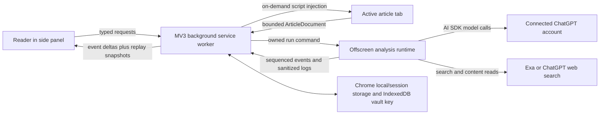

# Perspectica architecture

Perspectica is a self-contained Manifest V3 Chrome extension. The production build has no
Perspectica-operated API, database, or remote executable code. Article extraction, orchestration,
local persistence, and UI rendering run in extension contexts; only the providers selected by the
reader receive article or research data.

## Runtime topology

The side panel owns the one-time, user-gesture article-access request required by Chrome. The
service worker enforces that grant and owns authentication, durable job state, and message
validation. The offscreen document owns long-running analysis so ordinary service-worker
suspension does not interrupt a run. The side panel is otherwise an untrusted presentation
client: it can request supported operations but never receives provider credentials.

## Analysis flow

1. The reader starts an analysis.
2. The background validates the active tab and injects the packaged extractor.
3. Extraction accepts article-like pages, normalizes the canonical URL, caps article content and
   links, and rejects generic pages before any provider call.
4. The background creates a job with a unique `runToken`, revision, and event sequence.
5. The offscreen runtime starts the Article Lens and independent research lanes.
6. Article Lens produces exact article claims, passages, political signals, and bias candidates.
7. Journalist research can start immediately from the byline. Political, bias, supporting,
   contradicting, and additional-context specialists use the lens dossier when it is ready.
8. Each completed lane is validated and emitted immediately. Later evidence reconciliation emits
   a replacement snapshot only when source assignment materially changed.
9. The background atomically persists accepted events and streams compact deltas to the side
   panel. A full job snapshot remains available for replay after panel or service-worker restart.

### Agent and tool boundaries

- Model-agent concurrency and search-provider concurrency are bounded separately.
- Three complementary initial searches are run in parallel inside each research specialist.
- A specialist may make one focused follow-up search when a named question remains unresolved.
- Search results and full source reads are canonical-URL cached and in-flight deduplicated across
  specialists.
- A transient model failure can retry without discarding sources already retrieved by that
  specialist.
- Returned citations must reference URLs actually read by the specialist. Exact excerpts and
  article paragraph references are validated before display.
- A legitimate empty result remains distinct from a provider, parsing, or timeout failure.

## Job lifecycle

Every run has one owner token. Incoming events must match that token and have a sequence greater
than the stored sequence. Atomic job updates make these invariants hold even if Chrome delivers
messages close together.

Terminal states are immutable:

- `complete` — every requested section completed or returned a valid empty result;
- `partial` — one or more sections failed while other results remain useful;
- `failed` — the run could not produce a report;
- `cancelled` — the reader stopped or replaced the run.

A non-terminal job stores the bounded request needed for recovery. Reopening the side panel
replays the current snapshot instead of creating a duplicate analysis. Recreated runtime contexts
can resume only when the persisted job and run token still match.

## Streaming protocol

The extension uses Chrome runtime ports and validated data-part-like messages rather than HTTP
SSE. `analysis.eventDelta` is the low-latency path; `analysis.jobChanged` and a bounded polling
fallback provide recovery.

The UI reducer treats ready events as replaceable section snapshots. It renders each section as
soon as it arrives, reports real completed-lane counts, and uses a short first-insert reveal for
readability. Replayed content does not animate again. Reduced-motion preferences disable
nonessential motion.

## Local data and credentials

- ChatGPT access tokens are kept in `chrome.storage.session`.
- A refresh token is memory-only unless **Remember me on this device** is enabled.
- Remembered ChatGPT refresh tokens and Exa API keys are encrypted with AES-256-GCM in
  `chrome.storage.local`.
- The non-exportable Web Crypto key is stored separately in IndexedDB.
- Preferences, bounded jobs, events, and sanitized telemetry remain in the current Chrome profile.
- Credentials are not included in runtime pushes, logs, analysis events, or article-page scripts.

This design protects against casual storage inspection, not a compromised or unlocked browser
profile.

## Reliability and observability

Provider calls, model steps, searches, source reads, queue waits, cache hits, retries, section
results, and errors are recorded as bounded sanitized telemetry. Telemetry persistence is
best-effort and cannot fail a healthy analysis. The **Copy logs** control exports the active run
without credentials.

The target is useful progressive output near 30 seconds, not a 30-second hard timeout. Provider
calls retain explicit higher safety timeouts so a slow but healthy section can complete. Readers
can cancel an active run.

## Release checks

`pnpm verify:release` runs formatting, type checking, tests, a production WXT build, ZIP packaging,
and package inspection. The inspection rejects local environment files, databases, datasets, and
other development artifacts from the unpacked production directory.
