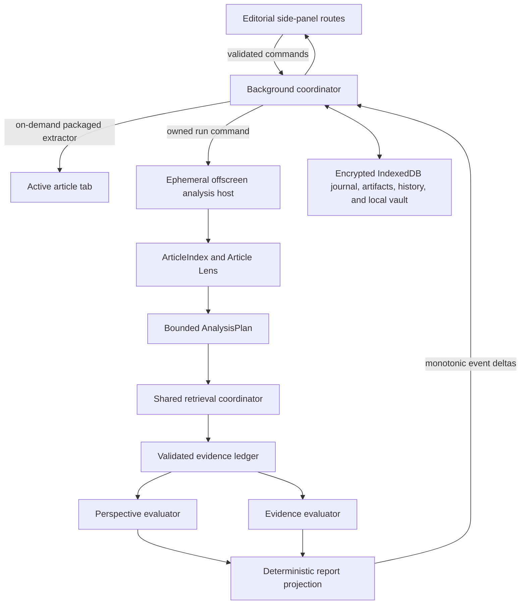

# Perspectica architecture

Perspectica is a self-contained Manifest V3 side-panel extension. It has no Perspectica-operated
API, hosted database, localhost service, remote executable code, or analytics endpoint. The
reader explicitly starts every analysis.

## Runtime topology

The background service worker is the privileged coordinator. It owns authentication, optional
host access, job identity, storage, run tokens, and message validation. The side panel is a
presentation client and never receives provider credentials. The offscreen document exists only
for a user-requested run and closes within five seconds of a terminal result.

## Analysis graph

1. Analyze extracts a bounded `ArticleDocument` from the active tab. The actual tab URL is the job
   identity; page-supplied canonical metadata is accepted only when same-origin.
2. A deterministic `ArticleIndex` assigns stable paragraph, sentence, claim-seed, entity, date,
   quantity, and link identifiers.
3. Article Lens produces article-owned framing signals and a bounded `AnalysisPlan`. Invalid model
   output falls back to deterministic planning.
4. One retrieval coordinator executes the plan against a shared candidate pool. Canonical URLs
   and syndicated copies are deduplicated before bounded source reads.
5. Adjudication can reference only planned claims and returned candidate IDs. Central validation
   enforces provenance, exact excerpts, relationship lanes, source type, and subject identity
   before the evidence ledger accepts an assertion.
6. Perspective and evidence evaluation share the finalized ledger. Projection emits Political
   Spectrum, Bias, Journalist Context, Supporting Information, Contradicting Information,
   Additional Context, and Works Cited.

Providers discover candidates; they do not assign claim relationships. Search summaries are
non-quoteable until Perspectica successfully fetches the publisher page and validates the exact
excerpt. The current article can never serve as its own independent evidence.

## Research depth and providers

Quick, Balanced, Deep, and Verified profiles bound missions, sources, model calls, context,
reasoning, and maximum run time. Their targets are progress expectations, not automatic
cancellation points. The graph stops early when evidence is sufficient.

Free is the default evidence provider. ChatGPT and Exa are optional. If either configured provider
is unavailable or returns no useful candidates, the coordinator records the degradation, falls
back to Free, and finally produces article-only analysis rather than hiding a provider failure.
Caches are isolated by public scope, hashed ChatGPT account identity, or hashed Exa-key identity.

## Political spectrum

The spectrum remains one-dimensional from `-3` to `+3`. Article framing supplies exactly 50% of
the placement. Verified publication history and journalist work share the contextual 50%; missing
context is reweighted inside that half. Comparable coverage can refine context but cannot invent
an article position. `Unclear` is allowed only after all article and contextual passes lack a
defensible signal.

## Durable execution

Every run retains one `analysisId`, `jobId`, and `runToken`. The append-only journal writes an
encrypted event envelope before advancing the compact job cursor. Repeated sequences are
idempotent, gaps are rejected, and reconnecting panels replay missing sequences before applying
live deltas. Targeted retries reuse the validated index, plan, candidate pool, and ledger, then run
only failed sections.

Resume payloads, active article artifacts, event/log bodies, and recent terminal reports are
AES-256-GCM encrypted locally. Recent history keeps at most ten runs or seven days with a 25 MB
cap. Preferences and compact non-content job metadata remain in Chrome storage. Access tokens are
session-only; remembered refresh tokens and Exa keys use the local vault.

## Editorial UI

Analyze, Running, Report, Settings, Diagnostics, and About are exclusive visible routes above one
persistent analysis controller. Opening Settings never cancels a run. The UI maps V2's internal
stages into four honest reader phases: Reading article, Planning research, Checking sources, and
Preparing report. Report sections subscribe independently through `useSyncExternalStore`, so a
progress update does not rerender every completed section.

All motion is packaged CSS/WAAPI, preserves whitespace, and respects reduced-motion preferences.
The compact sticky masthead, route focus, scroll restoration, 44px controls, and 320px reflow are
part of the side-panel contract.

## Security boundaries

- Article/source text is untrusted data, never policy or tool instructions.
- JSON-LD, DOM traversal, source responses, redirects, sizes, content types, and schemas are
  bounded before use.
- Production fetches require HTTPS and reject browser-internal, file, data, localhost, private,
  reserved, and redirect-to-disallowed destinations.
- Diagnostics redact credentials, cookies, authentication parameters, signed URLs, and sensitive
  query strings. Copying a support log requires an explicit warning.
- Runtime commands validate sender context, protocol version, run token, sequence, and payload.

See [V2 details](architecture-v2.md), [provider boundaries](provider-boundaries.md), [privacy](privacy.md),
and the [threat model](threat-model.md).
