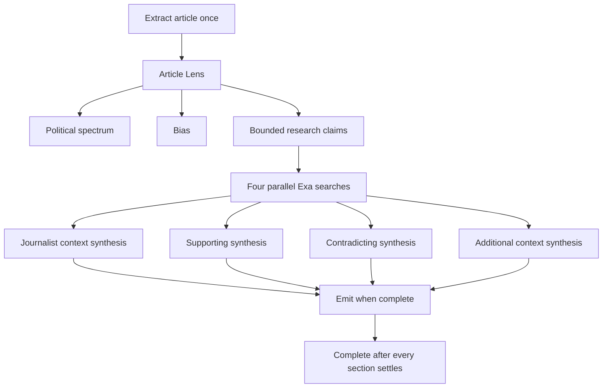

# Perspectica Progressive Parallel Research Design

## Decision

Perspectica uses a progressive, balanced analysis pipeline. One Article Lens call reads the
article and produces political-spectrum evidence, bias findings, and a small set of
researchable claims. The reader sees the political spectrum and bias as soon as that call
finishes. Four bounded research workers then start together and publish their sections in
completion order.

The side panel remains a simple document-like scroll. Parallelism is a backend behavior, not
an excuse to add cards, tabs, dashboards, or a dense progress interface.

## Pipeline

## Worker boundaries

Each research worker has one responsibility, one structured-output schema, one result limit,
and one failure boundary:

- Journalist Context finds relevant public work by the named journalist. It returns at most
  three findings and returns an explained empty state when the article has no usable byline
  or no relevant public work can be verified.
- Supporting Information researches the highest-value factual claims and returns at most
  three independent sources that materially support them.
- Contradicting Information researches the same claims for disagreement, correction, or
  important qualification and returns at most three independent sources.
- Additional Context returns at most two sources only when information outside the article
  is necessary to interpret a central claim.

The orchestrator owns concurrency and event delivery. Exa owns retrieval. GPT-5.6 Luna owns
bounded synthesis from already-retrieved evidence. Validation owns limits, URL verification,
exact-excerpt checks, URL deduplication, and result shape. The UI only consumes typed events.

## Concurrency and failure behavior

The four workers begin after Article Lens identifies researchable claims. Results are raced
and emitted in completion order. Perspectica does not wait for a fixed section order.

Every worker must settle as one of:

- `ready`: verified findings are available;
- `empty`: the worker completed but found no responsible result, with a short explanation;
- `error`: the worker failed and the section can be retried later.

A worker failure never cancels a sibling. The analysis completes only after all four workers
settle. The request abort signal still cancels the whole run when the reader leaves or starts
a replacement analysis.

For the POC, one Article Lens call plus four GPT synthesis calls stays within the
24-request-per-minute ChatGPT session allowance and leaves room for retries. The four Exa
retrieval calls use `fast` search with highlighted passages and begin in parallel. Research
prompts contain article metadata, a small claim set, and only the bounded retrieved
highlights rather than resending the full article or asking the model to browse.

Each Exa request has a 12-second timeout. Each GPT research synthesis has a 45-second
timeout and a 2,200-output-token limit. A slow or failed lane becomes a section-level error
without delaying successful siblings indefinitely.

## Model and latency policy

The live pipeline uses the exact `gpt-5.6-luna` model slug with medium reasoning. The Login
with ChatGPT model endpoint can lag newly accepted Codex models, so Perspectica merges a
small, explicit manual model list into account discovery and sends Codex client version
`0.144.4`. The responses proxy separately allowlists the model. This exposes Luna without
exporting credentials or bypassing the signed-in account; the upstream response still
rejects an account whose plan cannot use it.

An explicit `PERSPECTICA_CHATGPT_MODEL` override still wins only when the model is discovered
or manually exposed and is also on the proxy allowlist. The selected model and reasoning
effort are recorded in analysis metadata and developer logs.

The Article Lens remains the critical path to the first meaningful UI. Exa retrieval and
research synthesis are progressive and parallel. Future performance work should measure:

- Article Lens latency;
- Exa retrieval latency by lane;
- GPT synthesis latency by lane;
- time to each research section;
- total duration;
- model and reasoning effort;
- article input size;
- per-section success, empty, and error rates;
- repeated-article cache hits.

The provider-neutral `ResearchSearchProvider` boundary keeps Exa replaceable without
changing orchestration or UI contracts. Caching and durable run history remain separate
follow-up slices so the parallel orchestration can be evaluated before adding persistence.

## Side-panel presentation

The report starts directly with article metadata and the headline. The header is ordinary
document content and scrolls out of view. The brand/account row, Analyze Again action, and
section navigation are removed.

The political spectrum remains the only expandable section. Every other section is plain
text separated by headings and rules. Sections fade in as their independent results arrive.
No fixed completion footer is shown. The disconnect action remains a quiet text action at the
end of the document so account control is still available without crowding the report.
