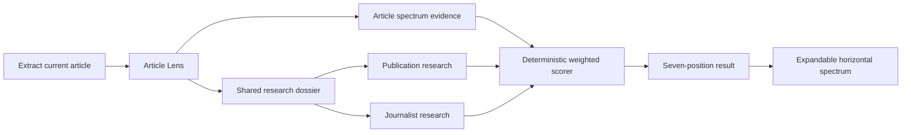

# Seven-position political spectrum

## Product decision

Perspectica places the current article on one horizontal spectrum:

**Far left · Left · Center-left · Center · Center-right · Right · Far right**

This replaces the two-axis political compass. It is easier to explain, quicker to scan in the side panel, and matches the team's goal of a Ground News-style transparency signal. The result describes the article's framing. It is not a permanent label for the publisher or journalist.

## Evidence order

The pipeline considers three evidence layers:

1. **Current article.** Exact language, framing, ordering, sourcing, and endorsed policy positions.
2. **Publication history.** Independent descriptions of a durable editorial orientation.
3. **Journalist work.** Recurring and relevant public professional patterns, when verified.

The article is primary. Publication history is a bounded prior. Journalist work is the weakest layer. Quoted political rhetoric is not treated as article ideology unless the article adopts or systematically frames it.

## Runtime flow

The political research lane uses multiple complementary Exa searches, reads the strongest sources, and may refine one unresolved question. It searches for durable publication history and relevant prior journalist work rather than using hard-coded outlet labels.

## Scoring

Each accepted signal has:

- a score from -3 to 3;
- direction (`left`, `center`, or `right`);
- strength;
- relevance;
- an exact excerpt and explanation.

Within each evidence layer, Perspectica computes a strength-and-relevance weighted mean. When all layers exist, the default influence is:

- article: 75%;
- publication: 18%;
- journalist: 7%.

Missing context is removed rather than guessed. A context-only result is allowed when article framing is sparse, but its confidence is capped at 44%.

## Center and calibrated fallback

Center means the best-supported position is genuinely mixed, balanced, technocratic, or minimally ideological.

When live analysis exhausts its research without retaining a usable article,
publication-history, or journalist-work signal, it still returns a cautious
placement:

- a publication represented in the 100-article dataset uses that publication's
  aggregate score as a low-confidence calibration;
- an unknown publication falls back to Center with very low confidence; and
- the UI identifies this basis as a calibrated estimate.

Article evidence and current live research always override this fallback.
`Unclear` is reserved for incomplete, invalid, or failed analysis states rather
than ordinary evidence exhaustion.

## Confidence

Confidence uses:

- number of accepted article signals;
- average signal strength;
- agreement among signals;
- presence of independent publication research;
- presence of relevant journalist research.

The UI always shows confidence separately from placement. A low-confidence
placement is more informative than silently pretending certainty or returning
Unclear after a successful analysis.

## Interface

The Political Spectrum section remains the only expandable report section. When opened, it shows:

- one horizontal seven-stop rail;
- a gold point at the computed score;
- a hover/focus tooltip with the label and score;
- a short explanation;
- confidence and evidence basis;
- exact article evidence;
- linked publication and journalist context.

The compact row shows only the section name, result label, and expand control, preserving the existing simple editorial layout.

## Calibration

The repository includes a 100-article dataset: 10 articles across each of 10 publications, with four topical lanes and separate content-type metadata. Every record contains the current article, publication research, optional journalist research, evidence excerpts, influence weights, score, label, rationale, and confidence.

Dataset validation enforces:

- exactly 100 unique records;
- exactly 10 records per publication;
- valid score-to-label mapping;
- influence weights totaling 1;
- exact article-evidence grounding;
- valid research URLs;
- completed research status.
